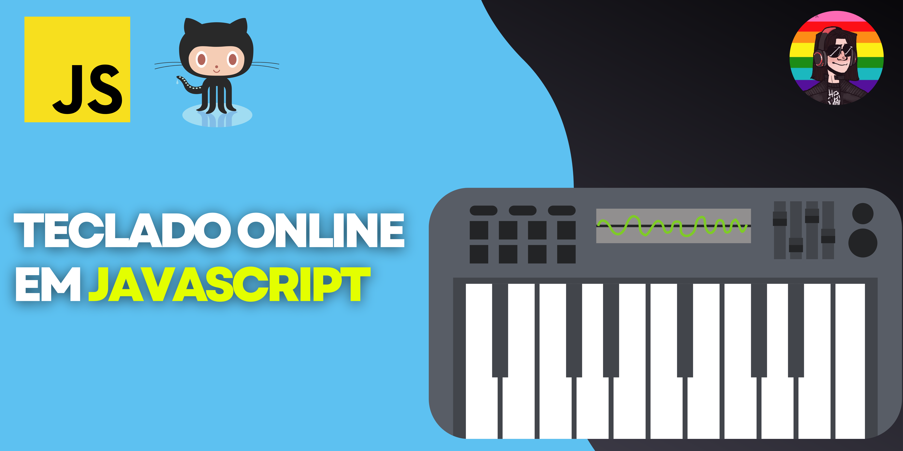

<h1 align="center">Piano online em Javasript</h1>  

   Projeto Piano online, feito para praticar minhas habilidades na linguagem, e para adcionar ao meu portfólio. O objetico do projeto foi fazer uma página que o usuário possa interagir tanto clicando nas teclas com o mouse ou usando seu própio teclado. As tecnologias usadas nesse projeto foram HTML, CSS, Javascript. Para acessar o projeto basta acessar o link abaixo.

  

<a href="https://guidev1.github.io/piano_em_js/">🚀 Acessar projeto</a>
